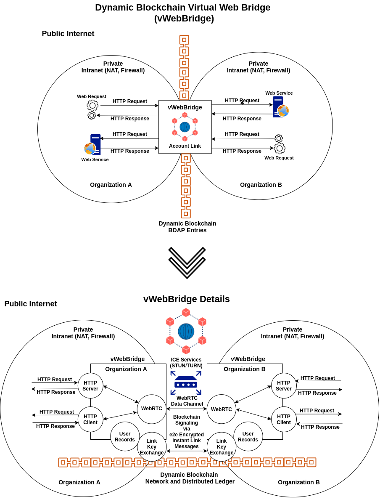
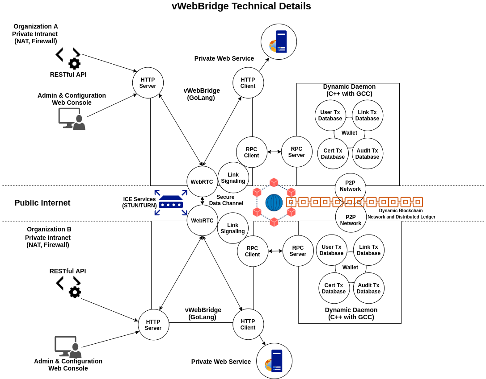

# WebBridge
Connecting HTTP servers and clients on disparate networks using WebRTC and blockchain signaling

## Running with dev and debug mode

```go
go run -race . -dev -debug
```

### Building

```go
# Linux Requires sudo apt-get install protobuf-compiler
go get -u -v github.com/golang/protobuf/proto
go get -u -v github.com/golang/protobuf/protoc-gen-go
protoc --go_out=. internal/goproxy/*.proto
go build -i -v -ldflags="-X 'main.GitHash=$(git describe --always --long --dirty)' -X 'main.Version=$(date +'%y.%m.%d')'" github.com/duality-solutions/web-bridge
```

```go
# Windows Requires protobuf compiler: https://github.com/protocolbuffers/protobuf/releases
go get -u -v github.com/golang/protobuf/proto
go get -u -v github.com/golang/protobuf/protoc-gen-go
protoc --go_out=. internal/goproxy/*.proto
go build -i -v -ldflags="-X 'main.GitHash=$(git describe --always --long --dirty)' -X 'main.Version=$(Get-Date -Format "yy.MM.dd")'" github.com/duality-solutions/web-bridge
```

#### Windows NMake

```shell
nmake /f Makefile
```

#### Linux Make

```bash
make
```

### Diagrams





### Copyrights

#### WebBridge Core

- Copyright (c) 2020, Duality Blockchain Solutions LLC. All rights reserved.

#### Socks Library

- Copyright (c) 2012-present, Samuel Stauffer <samuel@descolada.com>. All rights reserved.

#### RPC-Client Library

- Copyright (c) 2013-present The btcsuite developers. All rights reserved.
- Copyright (c) 2015-present The Decred developers. All rights reserved.

#### GoProxy Library

- Copyright (c) 2012-present Elazar Leibovich. All rights reserved.

#### Base58 Library

- Copyright (c) 2018 shengdoushi

### License

See [LICENSE.md](./LICENSE.md "LICENSE.md") file for copyright, copying and use information.
